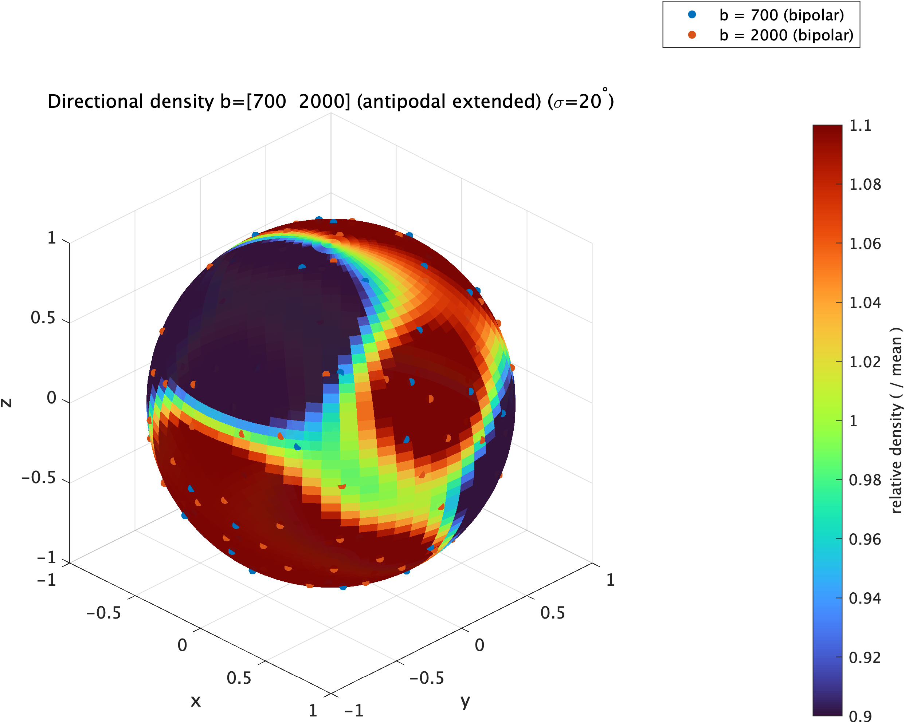
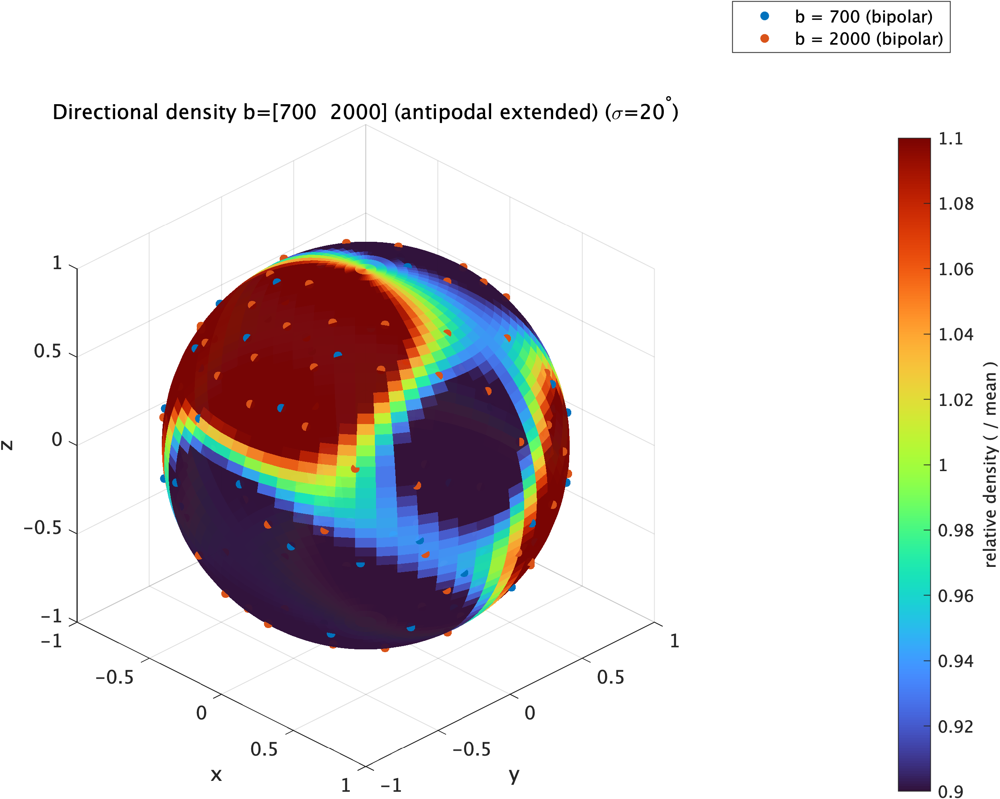
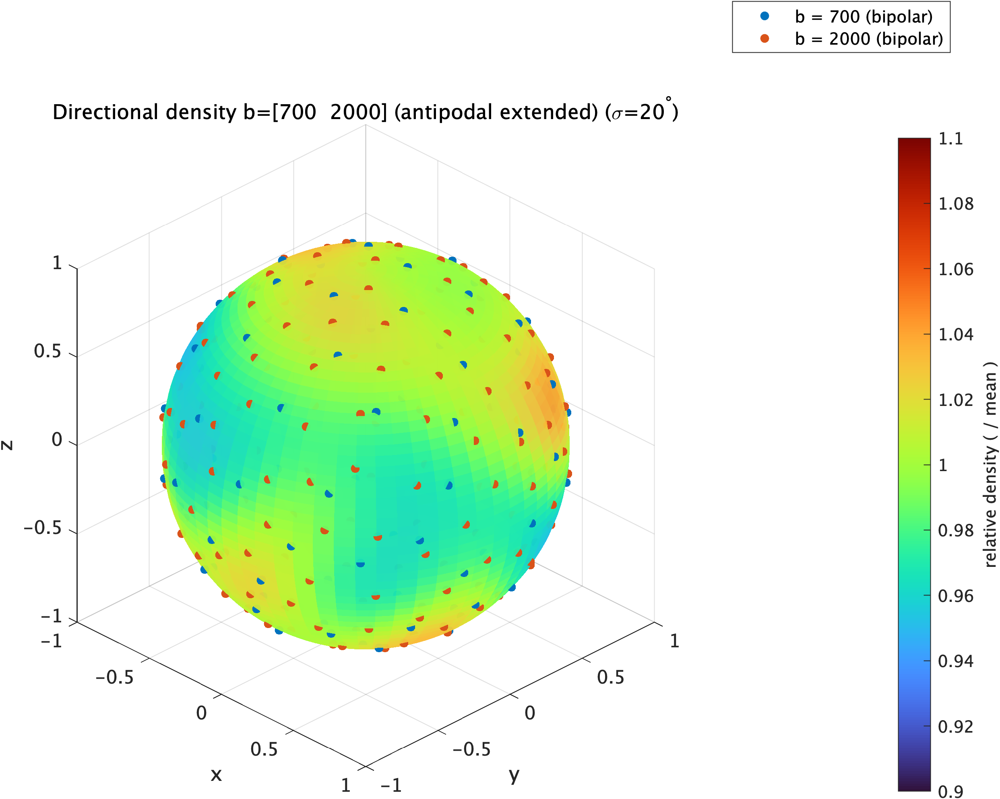

# visual_bvec

English | [日本語](README.ja.md)

This tool is a MATLAB-based tool for intuitive and quantitative evaluation of the spatial distribution of gradient directions (bvecs) in diffusion MRI.

The uniformity of bvecs is an important factor that affects the accuracy of diffusion metrics and tractography, but it is difficult to understand the characteristics of the directional distribution from numerical vector coordinates alone. This tool visualizes the axial distribution of bvecs on a sphere and evaluates the uniformity of directional distribution in diffusion MRI protocols using multiple complementary metrics.

<p align="center">
  
  
  
</p>

## Features

- Selectable shells for visualization (for example, only some shells or all shells)
- Visualization of the axial distribution of each shell as a density heatmap on a sphere
- Output of an HTML report summarizing evaluations based on various uniformity metrics for each shell
- Automatic saving of heatmaps and graphs as PNG files, and numerical results as an Excel file

### Density Heatmap

Visualizes directional density on a sphere.  
By matching the scale even between datasets with different numbers of axes, differences in bias can be compared intuitively.

### Uniformity Metrics

#### 1. Spherical Voronoi

Calculates the area assigned to each direction on a sphere and evaluates the variability of those areas.  
In a uniform directional distribution, each cell area becomes similar, and the coefficient of variation and min/max become small.

#### 2. Metric based on spherical harmonics

Expands the directional distribution using spherical harmonics and quantifies bias in low-order and high-order components.  
This is useful for capturing the overall non-uniformity of the distribution.

#### 3. Nearest-neighbor angle

Calculates the angle to the nearest direction for each direction.  
This helps identify locally dense or sparse regions.

### Output

This tool generates the following outputs.

- Spherical density heatmap
- Histogram of Voronoi cell areas
- Histogram of nearest-neighbor angles
- Table of metrics
- HTML report combining the above

### Expected Applications

- Quality check during diffusion MRI protocol design
- Comparison of directional distributions between existing protocols
- Confirmation of uniformity when creating bvec subsets

### System Requirements

- MATLAB

### Installation

#### 1 Clone the repository

```bash
git clone https://github.com/Kikubernetes/visual_bvec.git
```

#### 2 Start MATLAB and add this repository to the path

```matlab
addpath(genpath('path/to/visual_bvec'))
```

## Example Usage

First, prepare the bvec / bval files to be evaluated. FSL format is recommended (for example, output files from dcm2niix).

### Display a heatmap

Move into the directory containing the bvec and bval files (or specify the files by absolute path).

Enter the values required for display as follows.

```matlab
bvec_file       = 'my_protocol.bvec';
bval_file       = 'my_protocol.bval';

target_b_list   = [1000 2000]; % Specify the b-values to display as a list
tol             = 50;          % Acceptable range of b-value variation (such as 995, 2015). Usually 50 is OK
sigma_deg       = 20;          % Larger values make the display smoother. Usually 20 is OK
use_antipodal   = true;        % Also use axes in the opposite direction. Usually true is recommended
```

```matlab
% Run
ss_plot_rel_heatmap( ...
    bvec_file, bval_file, target_b_list, tol, sigma_deg, use_antipodal);
```

The heatmap is displayed automatically (can be rotated interactively).
A screenshot is output as a PNG file in the current directory with a name like the following.
`my_protocol_b[1000_2000].png`

### Output a report

Enter the values required for display.

```matlab
dataset_name  = 'my_protocol';  % Name shown in the report. Can be set freely
bvec_file     = 'my_protocol.bvec';
bval_file     = 'my_protocol.bval';

target_b_list = [1000 2000]; % Specify the b-values to view in the heatmap as a list
tol           = 50;          % Acceptable range of b-value variation (such as 995, 2015). Usually 50 is OK
lmax          = 8;           % Maximum order used for spherical harmonics
html_name     = 'protocol1'; % This becomes the folder name. Be careful not to overwrite when running multiple times
```

```matlab
% Run
bvec_uniformity_report( ...
    dataset_name, bvec_file, bval_file, target_b_list, tol, Lmax, html_name);
```

A folder with the name specified by html_name is created in the current directory.
(In the above example, a folder named protocol1.)
Double-click protocol1.html in that folder to view the report in a browser.

#### When the protocol is divided into multiple blocks

If you want to combine and evaluate bvecs that are split into multiple files, prepare combined bvec and bval files in advance. A script for combining them is included in the repository.
For example, if they are divided into DWI1 and DWI2,

ombine_bvecs_and_bvals.sh DWI1.bvec DWI2.bvec

If only the bvec files are specified, the bval files are also combined automatically. The combined output files are named combined_DWI1_DWI2.bvec and combined_DWI1_DWI2.bval.